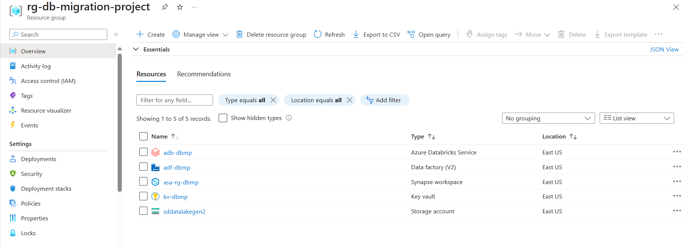

# Project Setup

## On-premises SQL Server Setup
1. Download [SQL Server](https://go.microsoft.com/fwlink/?linkid=799011&clcid=0x409&culture=en-us&country=us) and start in your local server
2. Download [SQL Server Management Studio (SSMS)](https://learn.microsoft.com/en-us/sql/ssms/download-sql-server-management-studio-ssms?view=sql-server-ver16) and connect to locally hosted SQL Server database. 
3. Download any AdventureWorks backup database from [here](https://github.com/Microsoft/sql-server-samples/releases/tag/adventureworks). I have considered [AdventureWorksLT2016](https://github.com/Microsoft/sql-server-samples/releases/download/adventureworks/AdventureWorksLT2016.bak) data in this project.
4. Load the data into SQL Server into using SSMS as desribed [here](https://learn.microsoft.com/en-us/sql/samples/adventureworks-install-configure?view=sql-server-ver16&tabs=ssms#restore-to-sql-server). The database should look like below in SSMS:

5. To access this database from Azure, we need to have a database user. Add an user to AdventureWorksLT2016 database by running the following commands in SSMS:
    ```
    CREATE LOGIN ssmsuser WITH PASSWORD = 'password';
    CREATE USER ssmsuser FOR LOGIN ssmsuser;
    ```
    Grant database reader (**db_datareader**) permission to the created under **Security > Users > Properties > Membership** in SSMS.


## Azure Cloud Setup
1. Create a [resource group](https://learn.microsoft.com/en-us/azure/azure-resource-manager/management/manage-resource-groups-portal#what-is-a-resource-group) for the project: **rg-db-migration-project**
2. Create the following services under the resource group: Azure Databricks Service, Data Factory (V2), Synapse Workspace, Key Vault, and a Data Lake storage account. 

3. Add the SQL Server database user credentials (step 5 of on-premises SQL Server Setup) to Key Vault.

    *Note: If you encounter RBAC error while adding secrets, grant yourself IAM Role **KeyVaultAdministrator** under **Access Control (IAM)** of Azure Key Vault resource.*
4. Navigate to data lake resource and create the following containers under Data Storage:
    - __bronze__: to store raw ingested data
    - __silver__: to store enriched data
    - __gold__: to store final transformed data
