# Data Ingestion

## Create and isntall Self-Hosted Integration Runtime

Navigate to Azure Data Factory (ADF) resource (named **adf-dbmp**) resource and create a Self-Hosted Integration Runtime (SHIR) under __Manage > Create Self-Hosted Integration Runtime for SQL Server__. This provides the compute infrastructure needed by ADF to dispatch data transfer activities from on-premises SQL Server database. Install SHIR on your system hosting the SQL Server database. 


## Create necessary Linked Services to build data ingestion pipeline

Create a pipeline under __ADF > Author > Pipeline > New Pipeline > copy_pipeline__. This pipeline is just to create all Linked Services needed for data ingestion.

Add 'Copy data' activity to the pipeline.

### Specifying Source and Sink

__Source is SQL Server__. Create SQL Server Linked Service (named **onpremsqlserver**) specifying database's connection properties. Make sure to have SQL server authentication mode enabled in SSMS.

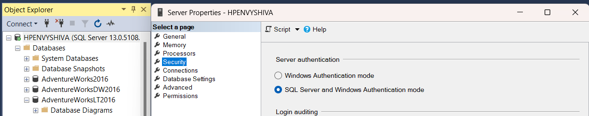


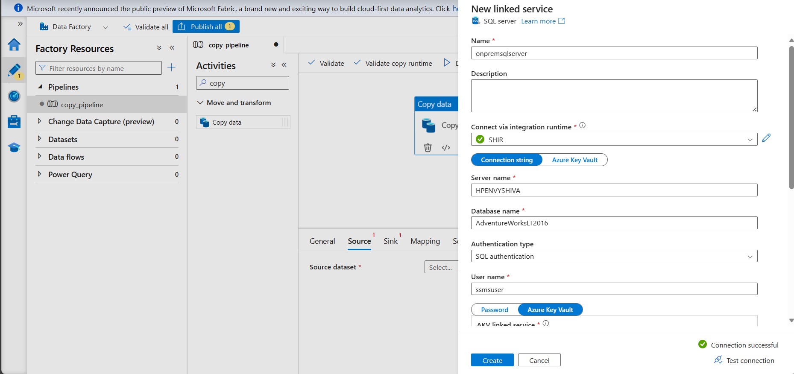

For accessing db connection parameters stored in Key Vault (KV), create an AKV Linked Service for the SQL Server Linked Service. Grant __Key Vault Secrets User__ permission to ADF resource (__adf-dbmp__, a managed system identity) under __Access Control (IAM)__ in Key Vault resource. This will display all available secrets under Key Vault.

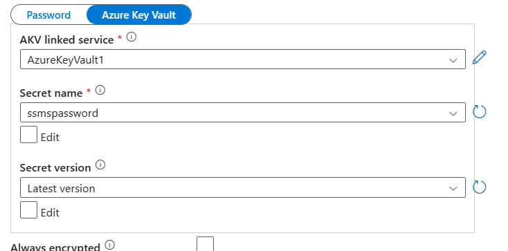

Now, ADF will be able to connect to on-prem SQL Server database.

**Sink** is bronze container in **sddatalakegen2** resource.

Create Azure Data Lake Storage Linked Service (__AzureDataLakeStorage1__). Use AutoResolveIntegrationRuntime as the resource is cloud based. Specify file path, bronze container as shown in the below figure.

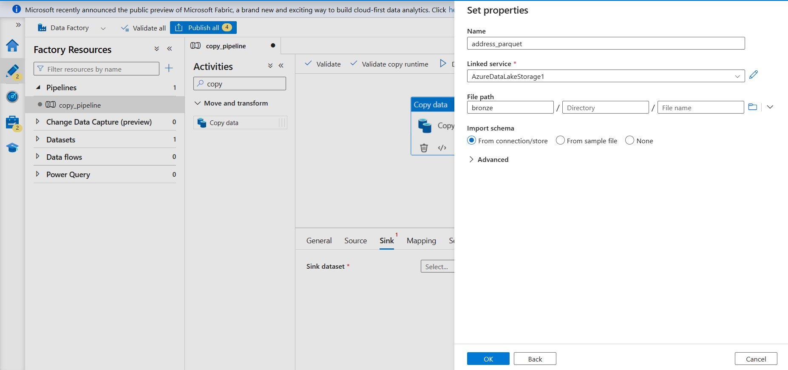

Publish all these changes to ADF, and now, we have all services needed for data ingestion.


## Create data ingestion pipeline

Start by authoring an ADF pipeline: **copy_all_tables**. 

Add 'Lookup' activity to the pipeline (named **Look for all tables**). The purpose of this activity is to return all tables in the SQL Server database. Under activity settings, use **onpremsqlserver** linked service and specify the source dataset as **SqlDbTables**. Use the 'Query' option to fetch the list of table names in SQL Server.

```
SELECT
s.name AS SchemaName,
t.name AS TableName
FROM sys.tables t
INNER JOIN sys.schemas s
ON t.schema_id = s.schema_id
WHERE s.name = 'SalesLT';
```

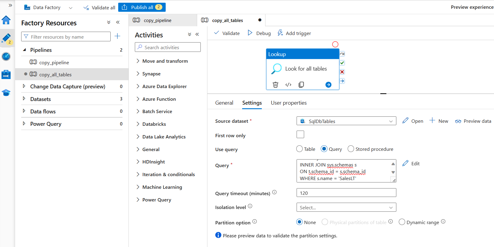

This activity returns a JSON containing all source table names in the following format:

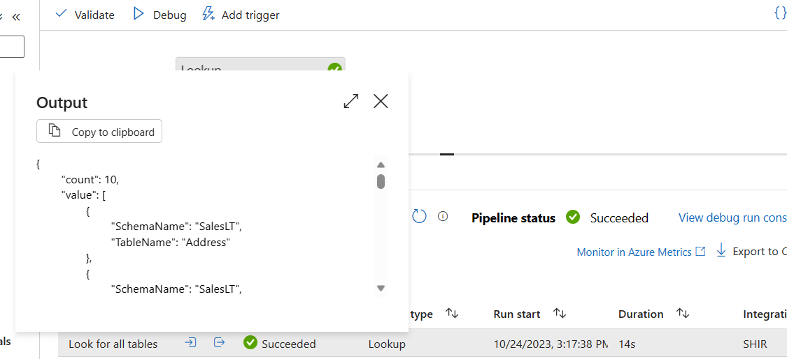

Next, add 'ForEach' activity that will copy data from SQL server to bronze data lake container for each table found in the JSON output of **Look for all tables** activity.

For ‘ForEach’ activity, under Settings, specify the JSON value as Items: 
`@activity(‘Look for all tables’).output.value`

Next, we define 'Copy Each Table' activity inside 'ForEach' activity, that will execute in each loop, copying data from on-prem database to data lake.

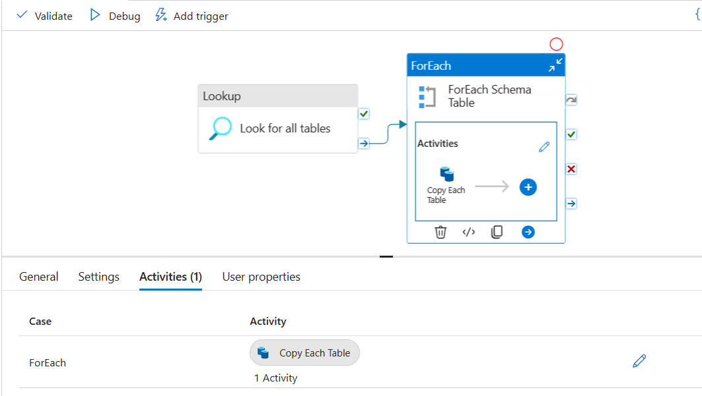

Use dynamic content query to specify Source for 'Copy Each Table' activity as shown below:

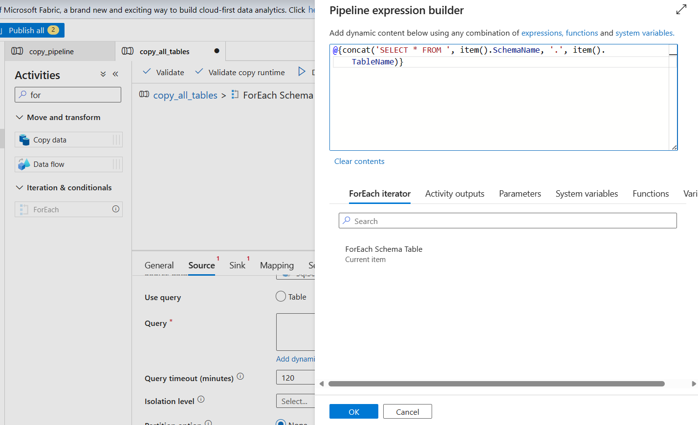

Use **AzureDataLakeStorage1** linked service, named **parquetTables** to specify the Sink. Add dynamic parameters for schema name and table name:

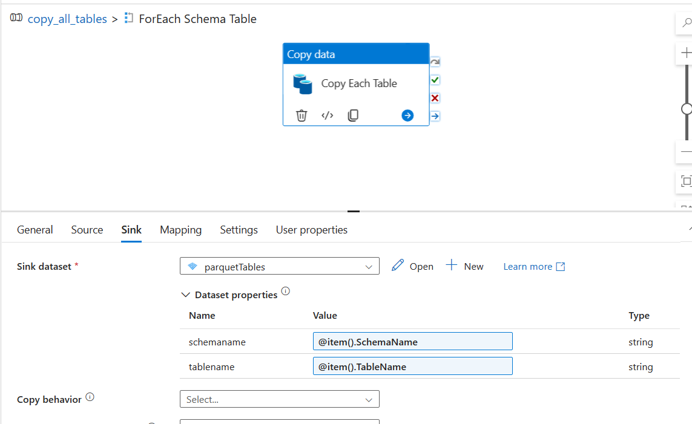

Use these parameters to define the folder structure of bronze container for all copied tables.

File path parameters:
```
@{concat(dataset().schemaname, '/', dataset().tablename
@{concat(dataset().tablename, '.parquet')}
```

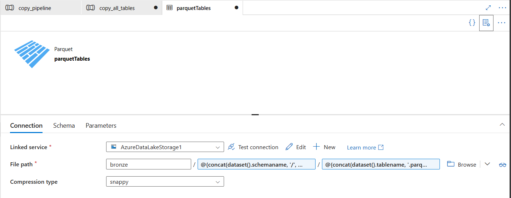

This will allow the creation of bronze data lake container folders in the following format: `bronze/Schema/Tablename/Tablename.parquet`.

Now, source and sink are configured. The pipeline is also ready, publish all changes, and trigger the pipeline. After the pipeline run is complete, the bronze container in data lake will look like this after successful data ingestion:

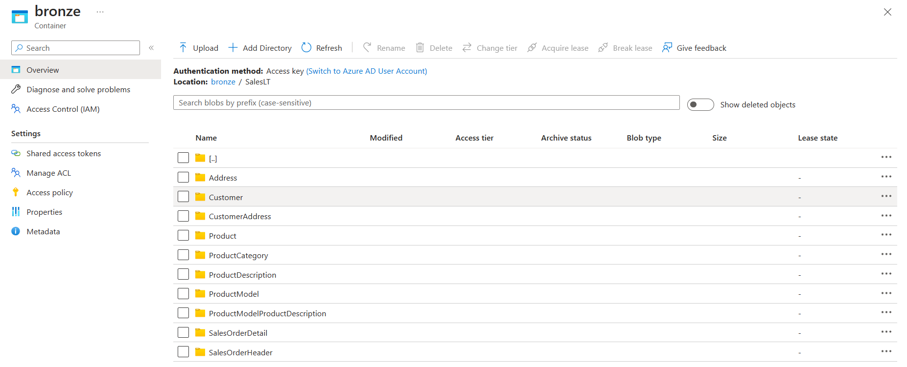

