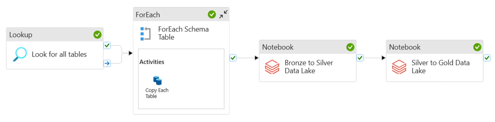

# Data Transformation

In this project, Azure Databricks service will be used to transform source data and move it from bronze container to silver to gold container in Azure Data Lake.

## Creating the Azure Databricks Compute Workspace
Go to **adb-dmp Databricks reource > Create Compute**.

- Create a Single node cluster
- **Enable credential passthrough for user-level data access** under Advanced options for Key Vault access. This is needed because we cannot give managed identity level access to databricks resource for accessing data in data lake. By enabling this option, databricks will leverage the user-level data access permission to read data from data lake.

## Mounting the data lake to Databricks File System
To read data from data lake, we first need to create mount points in Databricks File System. We can do so by following the instructions given in this link: [Access Azure Data Lake Storage using Microsoft Entra ID (formerly Azure Active Directory) credential passthrough (legacy) - Azure Databricks](https://learn.microsoft.com/en-us/azure/databricks/data-governance/credential-passthrough/adls-passthrough#--azure-data-lake-storage-gen2-1)

This is accomplished in [0_data_lake_storage_mount.ipynb](0_data_lake_storage_mount.ipynb).

## Perform data transformation
Next, some more data transformations are executed in [1_data_transform_bronze_to_silver.ipynb](1_data_transform_bronze_to_silver.ipynb) and [2_data_transform_silver_to_gold.ipynb](2_data_transform_silver_to_gold.ipynb) while moving data from bronze to gold container in data lake.

## Adding data transformation notebooks to Azure Data Factory pipeline
- Create an access token in Azure Databricks by going to **User Settings > Developer**.
- Add the generated access token to Key Vault
- Create a linked service in Azure Data Factory to connect to Azure Databricks workspace using the created access token
- Now we can add two activities to our previous **copy_all_tables** pipeline to transform data in bronze container and move it into gold container

