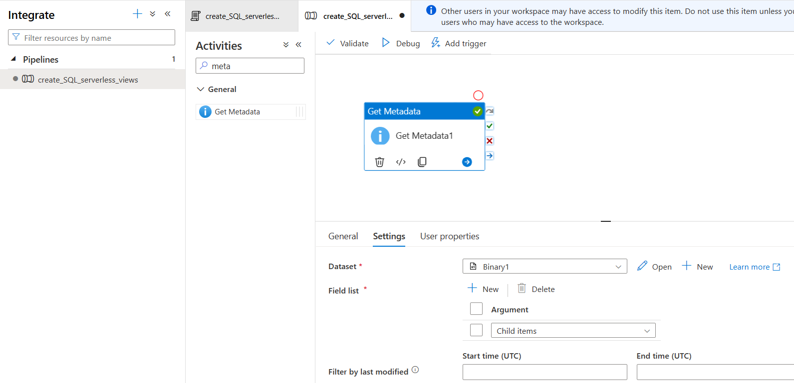
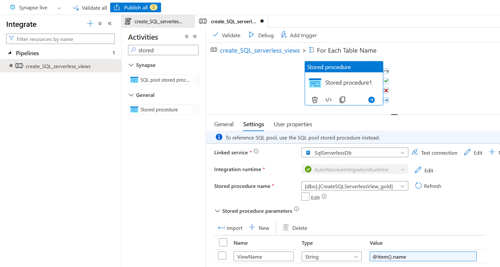
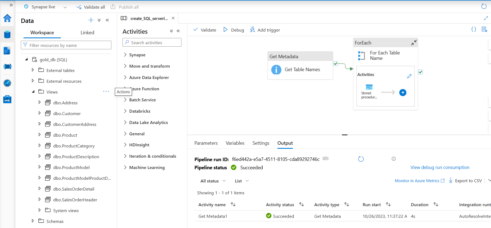

# Data Loading

In this section, we load the data from Data Lake to a Synapse SQL database using Azure Synapse Analytics. This provides a means for querying data in the data lake and is useful for reporting needs.

Synapse Analytics is built on top of Azure Data Factory and allows us to integrate data, create databases and workflows.

Azure Synapase Analytics provides 2 options for creating databases:
Lake database and Synapse SQL database. 
- Lake Databases are synchronized between the Spark and the SQL Serverless engines in Synapse, while Synapse SQL Database is a dedicated pool for low latency and higher concurrency requirements like reporting dashboards.
- Data Lake is cost-effective for extremely large datasets and enables experimentation and ad-hoc analysis at a lower cost, while Synapse SQL Database is recommended over Apache Spark for concurrency constraints.

We start data loading for reporting needs by creating a Synapse SQL database.
There are two pooling options: Serverless or Dedicated 
- Serverless does not store data, only accesses data from storage accounts, while Dedicated pool stores data in relational tables.
- Serverless scales the compute resources automatically, while Dedicated pool keeps a static number of servers and distributions according to the service level.
- Serverless can handle structured or unstructured data in different file formats, while Dedicated pool requires data to be in relational format.
- Dedicated is preferred for low latency workloads, as serverless accesses compute resources from the default pool
- Serverless uses only compute resources whereas dedicated uses both compute and storage resources

For this project, we are creating a Serverless SQL Database (named **gold_db**) in Azure Synapse Analytics. Views will be created for all tables present in gold container in data lake, and we have [create_SQL_serverless_views.sql](create_SQL_serverless_views.sql) to achieve this. Create and save this script by navigating to **Synapse > Develop > SQL Script**.

### Create an integration pipeline in Azure Synapase Analytics to create views for reporting needs

Create a Linked Service to Serverless db data in Synapse by going to **Manage > Linked Service > Azure SQL Database**. You'll need the domain name of synapse that can be obtained under __Properties__ tab in Synapse resource home page

Next step is to define the pipeline.
Go to **Synapse > Integrate > Pipelines**.

First activity is ‘Get Metadata’ which will fetch all table names from gold container in data lake.

Next activity is ‘ForEach’ which will fetch all table names and create corresponding views. ForEach activity will consist of one StoredProcedure activity which is run on each iteration. Make sure to specify stored procedure parameters under activity settings.

Now, the integration pipeline is ready. Trigger the pipeline to test it. All views will be created under Views in **gold_db** SQL serverless database.

As these are views, this integration pipeline need not be run everytime there is new data in source tables. One time creation of these views is enough unless there is change to underlying table structures.
