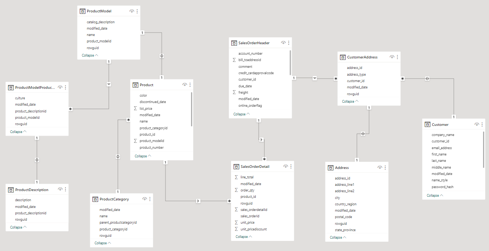
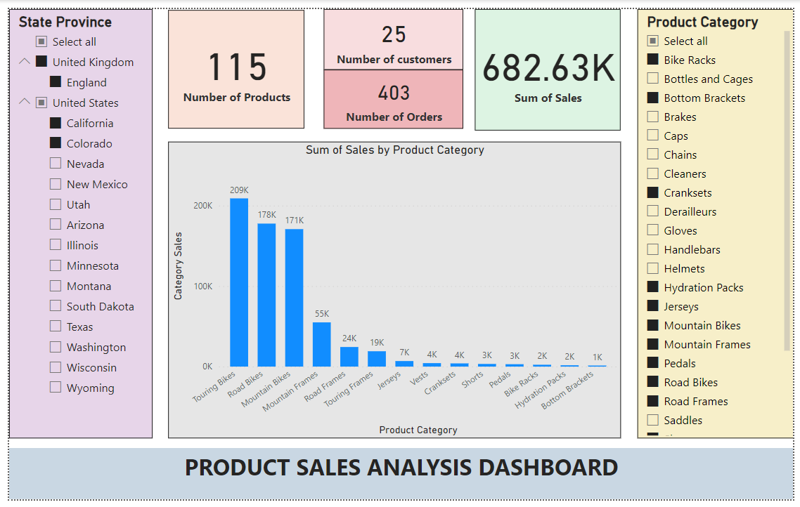

# Data Reporting

In this section, we create Power BI dashboards to visualize key metrics and display insights. The data is fetched the Synapse SQL Serverless database created in the [previous](/3_data_loading/README.md) section.

Open Power BI and establish connection to Azure SQL Database. Then for the simplicity in this project, we completely import the data from Synapse.

Once the data is imported into Power BI, the Model View will look like below:

Note that some relationships have to be created or modified based on how Power BI is able to relate data during import.

Next step is creating dashboards according to business needs. Below is an example interactive Product Sales Dashboard created as part of this project.

